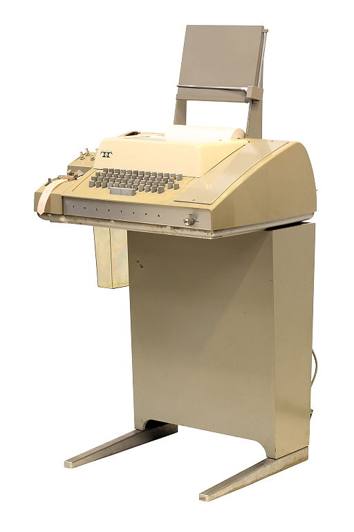
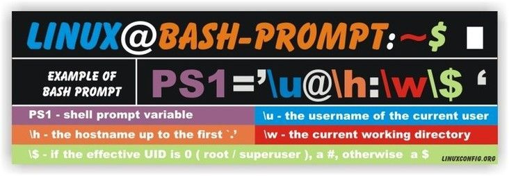
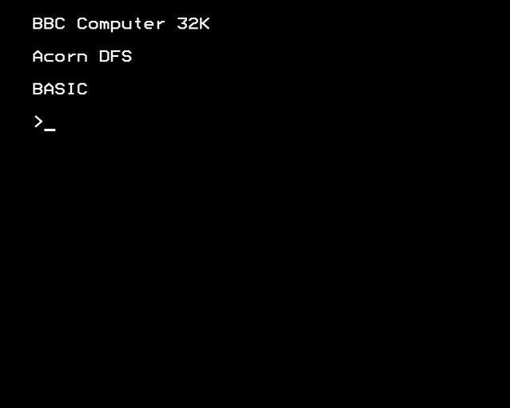
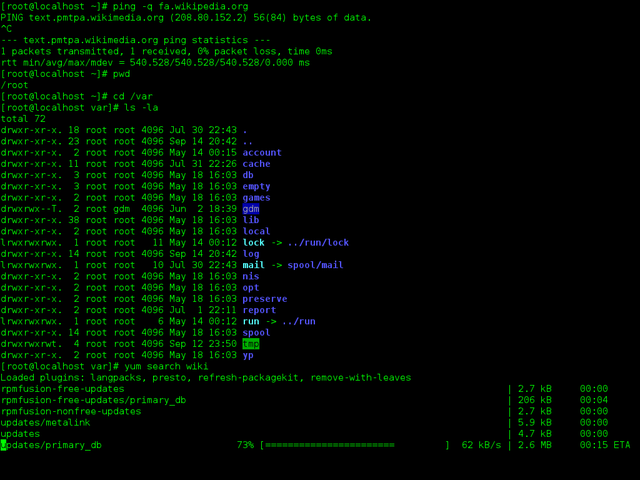
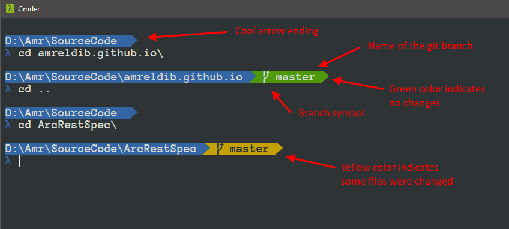
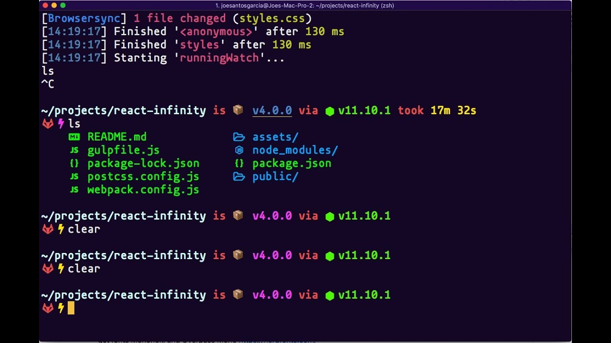

# Guía de terminal

## Terminal, consola, shell, línea de comandos y prompt

### Terminal


Una terminal es un dispositivo que nos permite comunicarnos con una computadora. Básicamente es una interfaz de usuario que nos permite enviar y recibir datos a una computadora principal remota (mainframe computer).




Su nombre deviene de los teletipos (TeleTYpe -tty, tt- o telex), terminales electromecánicas, usadas en el campo de la telegrafía, que recibían e imprimían textos y cintas perforadas, y permitían enviar datos a través de la lectura de cintas perforadas. Un teletipo muy usado fue el Teletype ASR 33 (1963).


Cuando se empezaron a imponer las terminales con pantallas de tubos de rayos catódicos como la Tektronix 4010 (1972), las electromecánicas lentamente comenzaron a caer en desuso.

[Video de Teletipo ASR 33 funcionando](https://youtu.be/S81GyMKH7zw)


En la imagen superior podemos ver una foto donde se encuentran Dennis Ritchie (parado), creador del lenguaje C, y Ken Thompson (sentado), creador de Unix y de los lenguajes B y Go, escribiendo en una terminal Teletype ASR 33 y de fondo una minicomputadora Digital Equipment Corporation PDP-11 de 16-bit (circa 1972).

### Consola


Muchas veces se usa el término consola como sinónimo de terminal, pero precisemos un poco más su sentido. Una consola hacía referencia al conjunto compuesto por un dispositivo de entrada de tipo teclado (que inicialmente sólo disponía de teclas con números y sin ratón) y un dispositivo de salida como la pantalla que complementaba al anterior y como conjunto nos permitía un dominio de operación y control de la computadora.

A día de hoy se suele usar el término consola como el modo no gráfico del emulador de terminal, es decir sin GUI, ni la opción de usar un ratón. También se lo denomina full-screen keyboard-text-only mode console.

### Shell


En 1969 aparecería UNIX, el primer sistema operativo portable, multitarea y multiusuario. Para comunicarse con el sistema operativo se usaría un programa llamado Thompson shell (Ken Thopmson, 1971, Unix v1 hasta v6), el primer shell (o intérprete de comandos de línea) de Unix. A partir de la versión 7 de Unix se incorporaría el Bourne shell (Stephen Bourne, 1979, Unix v7 hasta SVR4(1989)).

La metáfora de la caparazón (shell) hace alusión a aquello que contiene y protege el núcleo (kernel) del sistema operativo.

En 1989 aparecería en escena BASH (Bourne-Again SHell), escrito por Brian Fox esta vez desarrollado para el GNU project, que incorpora elementos de Bourne sh, csh y ksh.

En 1990 Paul Falstad desarrollaría Z shell, que incorpora elementos de Bourne sh, ksh y tcsh.

### Línea de comandos y prompt



Las terminales con pantalla contaban con un cursor titilante para indicar al usuario el espacio de escritura pero por sí mismo era pobre como interfaz de usuario. Por esta razón, los shells cuentan con una línea de comandos precedida por un prompt o indicador que indica el lugar a interactuar. Por ejemplo en unix contamos con un prompt con varios elementos:

`usuario@máquina:~$`

donde 'usuario' es el nombre del usuario, seguido de @máquina que corresponde al nombre de la computadora, la virgulilla indica el directorio principal y el signo $ denota que se trata de un usuario sin privilegios en el sistema.

`root@máquina:~#`

donde 'root' es el nombre del superusuario, seguido de @máquina que corresponde al nombre de la computadora, la virgulilla indica el directorio principal y el signo # denota que se trata de un usuario con privilegios de administrador del sistema.

En el cmd de windows el promp simplemente es: `c:/`



Mientras que el prompt del BBC Micro es: `>`








Arriba podemos ver otros ejemplos de personalización gráfica de shells.

## Git Bash

### Lista de comandos nativos en Git Bash

Bash, además de ser un intérprete de comandos de línea es un muy robusto lenguaje de programación que se utiliza comunmente en los denominados **scripts de bash**.

A continuación nosotros sólo nos concentraremos en algunos de los más usados comandos nativos de Git Bash:

```bash
echo $SHELL # devuelve el nombre del shell instalado en el sistema

echo $BASH_VERSION # devuelve la versión del shell de bash instalado

pwd   # ver en qué directorio estoy

pwd --help   # ver la ayuda del comando pwd

pwd -W # ver en qué directorio estoy utilizando la opción '-W' que activa el formato de rutas de Windows

cd    # cambiar directorio de usuario: Home

cd /  # cambiar directorio raiz de mi disco

cd ~  # cambiar directorio de usuario: Home

ls    # list directory

ls -l # list directory en forma lista

ls -la # list directory en forma lista y con elementos ocultos

^ v   # flecha arriba y flecha abajo

clear o ctrl/cmd+l # limpiar la pantalla de la terminal

cd /C # cambiar directorio raiz de mi disco c

cd Users # cambiar directorio Users

cd .. # para volver al directorio anterior

cd U[TAB] # cambia directoria a la carpeta U...

cd Us[TAB] # cambia directoria a la carpeta Users porque es el único con esas dos letras

mkdir proyecto1 # crea directorio proyecto 1

ls proyecto1 # cambio directorio a proyecto1

touch README.md # creo un archivo vacío con el nombre 'README.md'

cd . # cambio directorio a la carpeta actual

cd .. # cambio directorio a la carpeta anterior a la actual

# Ahora abro el archivo README.md con el Explorador de Windows y escribo el siguiente texto: 'Este es un mensaje'. Guardo el archivo.

cat README.md # el comando 'cat' (conCATenate) imprime en pantalla el contenido del archivo README.md

history # muestra el historial de comandos introducidos

!32 # ejecuta el número de comando 32 del historial

rm README.md # borra el archivo README.md: ¡¡¡¡MUCHO CUIDADO CON ESTE COMANDO!!!!

echo 'Este es un mensaje creado desde la terminal' > README.md # el comando echo repite el argumento 'Este es un mensaje creado desde la terminal' y redirecciona dicha salida con el operador '>' al archivo archivo 'README.md' que si no lo encuentra entonces lo crea.

cat README.md # imprime en pantalla el contenido del archivo README.md

echo 'Este es un segundo mensaje' >> README.md # el comando echo repite el argumento 'Este es un segundo mensaje' y redirecciona dicha salida de forma agregada con el operador '>>' al archivo archivo 'README.md' que si no lo encuentra entonces lo crea.

cat README.md # imprime en pantalla el contenido del archivo README.md
```

### Algunos atajos

CTRL + A: envía cursor al principio de la línea

CTRL + E: envía cursor al final de la línea

ALT + B: envía el cursor al principio de la palabra anterior

ALT + F: envía el cursor al principio de la palabra posterior

## Referencias

[GNU Bash Manuals](https://www.gnu.org/software/bash/manual/)

[Bash Reference Manual v5.2 (.pdf)](https://www.gnu.org/software/bash/manual/bash.pdf)

[Learn Shell](https://www.learnshell.org/)

[Linux journey](https://linuxjourney.com/)

[Linux journey - Gthub repository](https://github.com/cindyq/linuxjourney)
